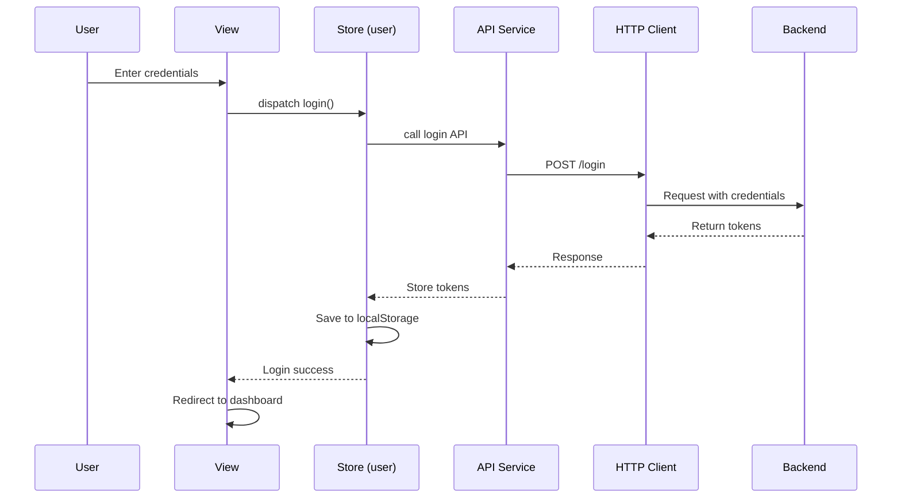
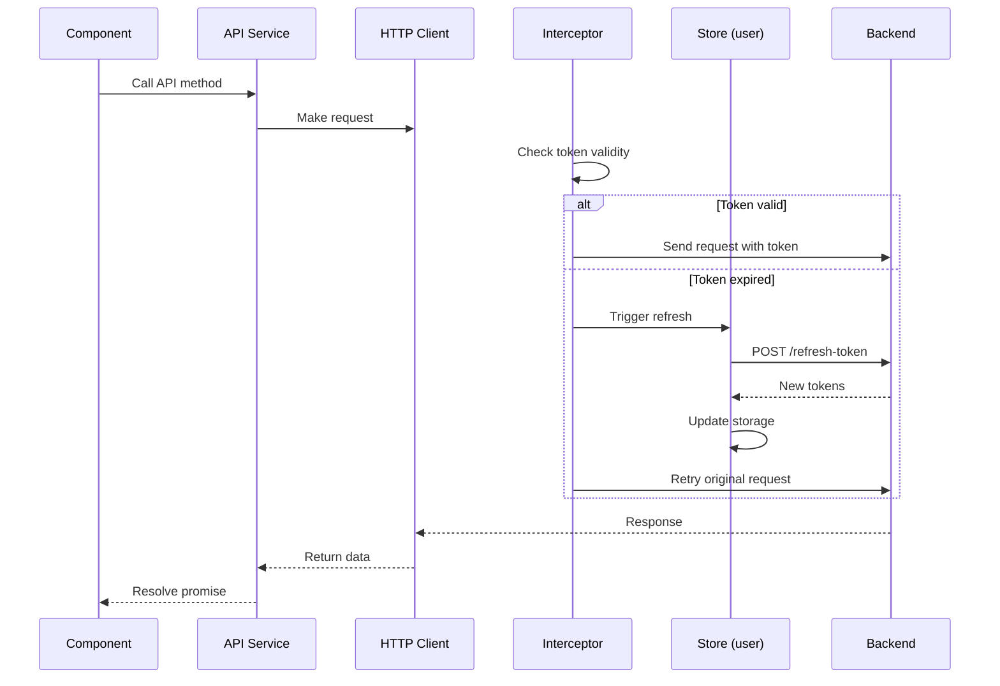
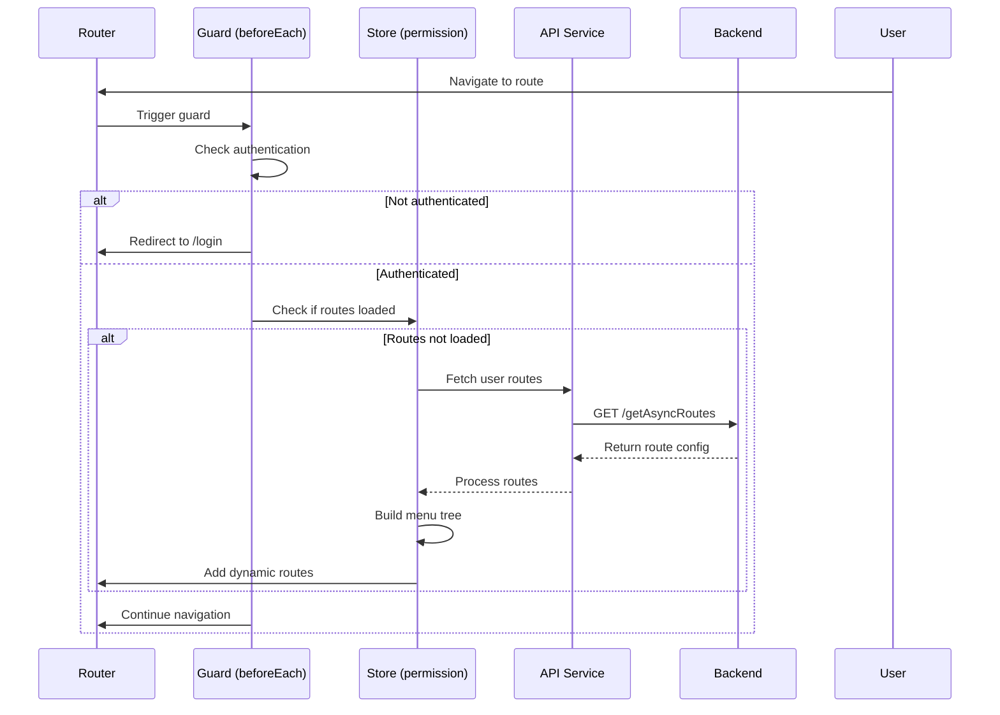

# MhWeb-Admin Architecture Documentation 🏗️

## Overview 📋

**MhWeb-Admin** is a modern, enterprise-grade admin management system built with Vue 3 ecosystem. This project is based on the [vue-pure-admin](https://github.com/pure-admin/vue-pure-admin) template and provides a comprehensive solution for managing mushroom-related content, user accounts, scientific popularization authors, disease and pest information, feedback, and banners.

### Project Identity
- **Project Name**: MhWeb-Admin (Mushroom Web Admin)
- **Version**: 1.0.0
- **Base Template**: vue-pure-admin
- **License**: MIT

---

## Technology Stack 🛠️

### Core Technologies
- **Frontend Framework**: Vue 3.5.13 (Composition API)
- **Build Tool**: Vite 6.0.3
- **Language**: TypeScript 5.6.3
- **State Management**: Pinia 2.3.0
- **Routing**: Vue Router 4.5.0
- **UI Component Library**: Element Plus 2.9.0
- **CSS Framework**: Tailwind CSS 3.4.16
- **HTTP Client**: Axios 1.7.9
- **Package Manager**: pnpm >=9

### Key Libraries & Plugins
- **Charts**: ECharts 5.5.1
- **Icons**: @iconify/vue 4.2.0, Iconify Icons (EP, RI)
- **Animations**: Animate.css 4.1.1, @vueuse/motion 2.2.6
- **Utilities**: 
  - @vueuse/core 12.0.0 (Vue composition utilities)
  - @pureadmin/table 3.2.1 (Enhanced table component)
  - @pureadmin/descriptions 1.2.1 (Description list component)
  - @pureadmin/utils 2.5.0 (Utility functions)
- **Image Processing**: Cropper.js 1.6.2
- **Date Handling**: Day.js 1.11.13
- **Authentication**: jwt-decode 4.0.0, js-cookie 3.0.5
- **Storage**: localforage 1.10.0, responsive-storage 2.2.0
- **Other**: mitt 3.0.1 (Event bus), nprogress 0.2.0 (Progress bar), sortablejs 1.15.6

### Development Tools
- **Linting**: ESLint 9.16.0, Stylelint 16.11.0, Prettier 3.4.2
- **Git Hooks**: Husky + lint-staged 15.2.10, Commitlint 19.6.0
- **Testing**: Vue TSC 2.1.10 (Type checking)
- **Build Optimization**: 
  - vite-plugin-compression 0.5.1
  - rollup-plugin-visualizer 5.12.0
  - vite-plugin-cdn-import 1.0.1
- **Mock Server**: vite-plugin-fake-server 2.1.4

---

## System Architecture 🏛️

### Architecture Pattern
The project follows a **Modular Monolithic Architecture** with clear separation of concerns:

```
┌─────────────────────────────────────────────┐
│           Presentation Layer                │
│  (Views, Components, Layout)                │
├─────────────────────────────────────────────┤
│         Business Logic Layer                │
│  (Composables/Hooks, Store Modules)         │
├─────────────────────────────────────────────┤
│          Data Access Layer                  │
│  (API Services, HTTP Client)                │
├─────────────────────────────────────────────┤
│          Infrastructure Layer               │
│  (Router, Plugins, Utils, Directives)       │
└─────────────────────────────────────────────┘
```

### Directory Structure 📁

```
mh-web-admin/
├── build/                    # Build configuration
│   ├── cdn.ts               # CDN optimization config
│   ├── compress.ts          # Compression settings
│   ├── info.ts              # Build metadata
│   ├── optimize.ts          # Dependency optimization
│   ├── plugins.ts           # Vite plugins configuration
│   └── utils.ts             # Build utility functions
│
├── mock/                     # Mock data for development
│   ├── asyncRoutes.ts       # Mock route data
│   ├── login.ts             # Mock login data
│   └── refreshToken.ts      # Mock token refresh
│
├── public/                   # Static assets (not processed by Vite)
│   └── platform-config.json # Platform configuration
│
├── src/                      # Source code
│   ├── api/                 # API service layer
│   │   ├── data.ts          # Data-related APIs
│   │   ├── routes.ts        # Route-related APIs
│   │   ├── system.ts        # System management APIs (615 lines)
│   │   └── user.ts          # User authentication APIs
│   │
│   ├── assets/              # Static assets
│   │   └── iconfont/        # Custom icon fonts
│   │       ├── iconfont.css
│   │       ├── iconfont.js
│   │       └── iconfont.json
│   │
│   ├── components/          # Reusable components
│   │   ├── ReAuth/          # Permission control component
│   │   ├── ReCol/           # Grid column component
│   │   ├── ReCountTo/       # Animated number counter
│   │   ├── ReCropper/       # Image cropper
│   │   ├── ReCropperPreview/# Cropper preview
│   │   ├── ReDialog/        # Enhanced dialog
│   │   ├── ReFlicker/       # Flicker animation
│   │   ├── ReIcon/          # Icon components (offline/online/font)
│   │   ├── RePerms/         # Permission display component
│   │   ├── RePureTableBar/  # Table toolbar
│   │   ├── ReSegmented/     # Segmented control
│   │   └── ReText/          # Text utilities
│   │
│   ├── config/              # Application configuration
│   │   └── index.ts         # Config loader
│   │
│   ├── directives/          # Custom Vue directives
│   │   ├── auth/            # Permission directive
│   │   ├── copy/            # Copy to clipboard
│   │   ├── longpress/       # Long press detection
│   │   ├── optimize/        # Performance optimization
│   │   ├── perms/           # Permission display
│   │   ├── ripple/          # Ripple effect
│   │   └── index.ts         # Directive registry
│   │
│   ├── layout/              # Layout components
│   │   ├── components/      # Layout sub-components
│   │   │   ├── lay-content/ # Main content area
│   │   │   ├── lay-footer/  # Footer
│   │   │   ├── lay-frame/   # iframe support
│   │   │   ├── lay-navbar/  # Top navigation bar
│   │   │   ├── lay-notice/  # Notification center
│   │   │   ├── lay-panel/   # Side panel
│   │   │   ├── lay-search/  # Search functionality
│   │   │   ├── lay-setting/ # Settings panel
│   │   │   ├── lay-sidebar/ # Sidebar navigation
│   │   │   └── lay-tag/     # Multi-tab tags
│   │   ├── hooks/           # Layout composables
│   │   │   ├── useBoolean.ts
│   │   │   ├── useDataThemeChange.ts
│   │   │   ├── useLayout.ts
│   │   │   ├── useMultiFrame.ts
│   │   │   ├── useNav.ts
│   │   │   └── useTag.ts
│   │   ├── frame.vue        # Iframe wrapper
│   │   ├── index.vue        # Main layout
│   │   ├── redirect.vue     # Route redirect
│   │   └── types.ts         # Layout type definitions
│   │
│   ├── plugins/             # Vue plugins
│   │   ├── echarts.ts       # ECharts integration
│   │   └── elementPlus.ts   # Element Plus setup
│   │
│   ├── router/              # Routing configuration
│   │   ├── modules/         # Route modules (auto-imported)
│   │   │   ├── banner.ts    # Banner routes
│   │   │   ├── content.ts   # Content routes
│   │   │   ├── diseasePest.ts # Disease & pest routes
│   │   │   ├── error.ts     # Error page routes
│   │   │   ├── feedback.ts  # Feedback routes
│   │   │   ├── home.ts      # Home/dashboard routes
│   │   │   ├── mushroom.ts  # Mushroom routes
│   │   │   ├── popSciUser.ts # PopSci author routes
│   │   │   ├── remaining.ts # Special routes (404, etc.)
│   │   │   └── user.ts      # User management routes
│   │   ├── index.ts         # Router instance & guards
│   │   └── utils.ts         # Route utilities
│   │
│   ├── store/               # State management (Pinia)
│   │   ├── modules/         # Store modules
│   │   │   ├── app.ts       # App state (sidebar, device)
│   │   │   ├── epTheme.ts   # Element Plus theme
│   │   │   ├── multiTags.ts # Multi-tab management
│   │   │   ├── permission.ts # Permission & menu state
│   │   │   ├── settings.ts  # User settings
│   │   │   └── user.ts      # User authentication state
│   │   ├── index.ts         # Store setup
│   │   ├── types.ts         # Store type definitions
│   │   └── utils.ts         # Store utilities
│   │
│   ├── style/               # Global styles
│   │   ├── dark.scss        # Dark theme variables
│   │   ├── element-plus.scss # Element Plus overrides
│   │   ├── index.scss       # Main stylesheet
│   │   ├── login.css        # Login page styles
│   │   ├── reset.scss       # CSS reset
│   │   ├── sidebar.scss     # Sidebar styles
│   │   ├── tailwind.css     # Tailwind imports
│   │   ├── theme.scss       # Theme variables
│   │   └── transition.scss  # Transition animations
│   │
│   ├── utils/               # Utility functions
│   │   ├── http/            # HTTP client wrapper
│   │   │   ├── index.ts     # Axios instance & interceptors
│   │   │   └── types.d.ts   # HTTP type definitions
│   │   ├── localforage/     # Local storage wrapper
│   │   │   ├── index.ts
│   │   │   └── types.d.ts
│   │   ├── progress/        # Progress bar utility
│   │   │   └── index.ts
│   │   ├── auth.ts          # Authentication utilities
│   │   ├── globalPolyfills.ts # Polyfills
│   │   ├── message.ts       # Message utilities
│   │   ├── mitt.ts          # Event bus
│   │   ├── preventDefault.ts # Default prevention
│   │   ├── print.ts         # Print utilities
│   │   ├── propTypes.ts     # Type validation
│   │   ├── responsive.ts    # Responsive storage
│   │   ├── sso.ts           # SSO utilities
│   │   └── tree.ts          # Tree data utilities
│   │
│   ├── views/               # Page components
│   │   ├── banner/          # Banner management
│   │   │   ├── utils/       # Banner utilities
│   │   │   ├── hooks.ts     # Banner composables
│   │   │   └── index.vue    # Banner list page
│   │   ├── content/         # Content management
│   │   │   ├── form/        # Content form
│   │   │   ├── utils/       # Content utilities
│   │   │   ├── hooks.ts     # Content composables
│   │   │   ├── index.vue    # Content list
│   │   │   └── tree.vue     # Content tree view
│   │   ├── diseasePest/     # Disease & pest management
│   │   │   ├── form/        # Form component
│   │   │   ├── utils/       # Utilities
│   │   │   ├── hooks.ts     # Composables
│   │   │   └── index.vue    # List page
│   │   ├── error/           # Error pages
│   │   │   ├── 403.vue      # Forbidden
│   │   │   ├── 404.vue      # Not found
│   │   │   └── 500.vue      # Server error
│   │   ├── feedback/        # Feedback management
│   │   │   ├── utils/       # Utilities
│   │   │   ├── hooks.ts     # Composables
│   │   │   └── index.vue    # Feedback list
│   │   ├── login/           # Login page
│   │   │   ├── utils/       # Login utilities
│   │   │   └── index.vue    # Login form
│   │   ├── mushroom/        # Mushroom management
│   │   │   ├── form/        # Mushroom form
│   │   │   ├── utils/       # Utilities
│   │   │   ├── hooks.ts     # Composables
│   │   │   └── index.vue    # Mushroom list
│   │   ├── popSciUser/      # PopSci author management
│   │   │   ├── form/        # Author form
│   │   │   ├── utils/       # Utilities
│   │   │   ├── hooks.ts     # Composables
│   │   │   └── index.vue    # Author list
│   │   ├── user/            # User management
│   │   │   ├── form/        # User form
│   │   │   ├── utils/       # Utilities
│   │   │   ├── hooks.ts     # Composables
│   │   │   └── index.vue    # User list
│   │   ├── welcome/         # Dashboard/Home
│   │   │   ├── utils/       # Dashboard utilities
│   │   │   ├── hooks.ts     # Dashboard composables
│   │   │   └── index.vue    # Dashboard page
│   │   └── welcome old/     # Legacy dashboard (deprecated)
│   │
│   ├── App.vue              # Root component
│   └── main.ts              # Application entry point
│
├── types/                   # TypeScript type definitions
│   ├── directives.d.ts      # Directive types
│   ├── global-components.d.ts # Global component types
│   ├── global.d.ts          # Global type declarations
│   ├── index.d.ts           # Main type exports
│   ├── router.d.ts          # Router type extensions
│   ├── shims-tsx.d.ts       # TSX shims
│   └── shims-vue.d.ts       # Vue shims
│
├── .env                     # Base environment variables
├── .env.development.local   # Development env (NOT committed)
├── .env.production          # Production env
├── .env.staging             # Staging env
├── .gitignore               # Git ignore rules
├── Dockerfile               # Docker build configuration
├── LICENSE                  # MIT License
├── README.md                # Project overview
├── commitlint.config.js     # Commit message linting
├── eslint.config.js         # ESLint configuration
├── index.html               # HTML entry point
├── package.json             # Dependencies & scripts
├── pnpm-lock.yaml           # Lock file (NOT committed)
├── postcss.config.js        # PostCSS configuration
├── stylelint.config.js      # Stylelint configuration
├── tailwind.config.ts       # Tailwind configuration
├── tsconfig.json            # TypeScript configuration
└── vite.config.ts           # Vite configuration
```

---

## Core Modules & Features 🎯

### 1. Authentication & Authorization 🔐

#### Authentication Flow
```
User Login → Token Storage → Request Interceptor → Token Validation → Auto Refresh → Response Handling
```

**Key Features:**
- JWT-based authentication with access token and refresh token
- Automatic token refresh when expired
- Request/response interceptors for token management
- White-list routes (login, refresh-token) bypass authentication
- Token storage in localStorage with expiration tracking

**Implementation:**
- `src/utils/auth.ts`: Token management utilities
- `src/utils/http/index.ts`: Axios interceptors
- `src/store/modules/user.ts`: User state management
- Route guards in `src/router/index.ts`

#### Permission Control
- **Route-level permissions**: Dynamic route generation based on user roles
- **Component-level permissions**: `<Auth>` and `<Perms>` components
- **Directive-level permissions**: `v-auth` and `v-perms` directives
- Role-based access control (RBAC)

### 2. Routing System 🛣️

#### Route Configuration
- **Static Routes**: Defined in `src/router/modules/*.ts` (auto-imported via `import.meta.glob`)
- **Dynamic Routes**: Fetched from backend after login
- **Special Routes**: 404, 403, redirect handled in `remaining.ts`

#### Route Features
- Multi-level nested routes (flattened to 2 levels for rendering)
- Route meta information (title, icon, roles, keepAlive, etc.)
- Route caching with keep-alive
- Multi-tab support with tag management
- Breadcrumb navigation
- Route transition animations

#### Navigation Guards
- **Global beforeEach**: Authentication check, permission validation, progress bar
- **Global afterEach**: Progress bar completion
- White-list handling for public routes
- External link detection and handling

### 3. State Management (Pinia) 📦

#### Store Modules

**user.ts** - User Authentication
- User info (id, username, roles, avatar)
- Token management (accessToken, refreshToken)
- Login/logout actions
- Token refresh mechanism

**permission.ts** - Permissions & Menus
- Dynamic route storage
- Menu tree generation
- Permission cache management
- Route flattening utilities

**app.ts** - Application State
- Sidebar collapse state
- Device type (desktop/mobile)
- Theme mode

**multiTags.ts** - Multi-tab Management
- Opened tabs tracking
- Tab operations (add, remove, close others)
- Tab persistence with localStorage
- Maximum tab limit enforcement

**settings.ts** - User Preferences
- Theme settings
- Layout preferences
- Display options

**epTheme.ts** - Element Plus Theme
- Theme color customization
- Dark/light mode switching

### 4. Layout System 🎨

#### Layout Components
- **LayNavbar**: Top navigation bar with user info, notifications, search
- **LaySidebar**: Vertical/horizontal navigation menu
- **LayContent**: Main content area with route-view
- **LayTag**: Multi-tab tag bar
- **LaySetting**: Settings panel for customization
- **LayNotice**: Notification center
- **LaySearch**: Global search functionality
- **LayPanel**: Collapsible side panel

#### Layout Modes
- Vertical layout (default)
- Horizontal layout
- Mixed layout
- Responsive design for mobile devices

#### Features
- Collapsible sidebar
- Fixed/sticky header
- Dark/light theme support
- Customizable colors
- Smooth transitions and animations

### 5. API Integration Layer 🔌

#### HTTP Client Architecture
```
Component → API Service → HTTP Client → Axios Instance → Backend API
                ↓              ↓
           Type Safety    Interceptors
                         (Auth, Error)
```

**Key Features:**
- Centralized HTTP client (`src/utils/http/index.ts`)
- Request/response interceptors
- Automatic token attachment
- Token auto-refresh on 401 errors
- Request deduplication during token refresh
- Error handling and notification
- Progress bar integration
- Timeout configuration (10s default)

#### API Services (`src/api/`)

**system.ts** (615 lines) - Main API service containing:
- **User Management**: CRUD operations, status updates, batch delete
- **PopSci Author Management**: Author CRUD, audit, avatar upload
- **Mushroom Management**: Mushroom CRUD, cover upload, detail images
- **Disease & Pest Management**: CRUD operations, cover upload
- **Content Management**: Content CRUD, audit, media uploads (images, videos)
- **Feedback Management**: List, delete, batch delete
- **Banner Management**: Banner CRUD, status updates, image upload

**user.ts** - Authentication APIs:
- Login
- Logout
- Token refresh
- User info retrieval

**routes.ts** - Route-related APIs:
- Dynamic route fetching

**data.ts** - Data/statistics APIs

#### API Conventions
- Base URL: `http://localhost:8080` (configured in vite.config.ts proxy)
- Request format: JSON (application/json) or FormData for file uploads
- Response format: Standardized `{ code, message, data }` structure
- Authentication: Bearer token in Authorization header
- Token formatting: `formatToken()` utility adds "Bearer " prefix

### 6. Component System 🧩

#### Reusable Components (`src/components/`)

**ReAuth** - Permission Control
- Conditionally renders content based on user permissions
- Usage: `<Auth :value="['admin']">Content</Auth>`

**RePerms** - Permission Display
- Shows/hides elements based on permissions
- Usage: `<Perms :value="['admin']">Button</Perms>`

**ReIcon** - Icon System
- Supports three icon types:
  - IconifyIconOffline: Local icons
  - IconifyIconOnline: Remote icons
  - FontIcon: Custom font icons
- Global registration in main.ts

**RePureTableBar** - Table Toolbar
- Integrated with @pureadmin/table
- Provides search, filter, column visibility controls

**ReDialog** - Enhanced Dialog
- Programmatic dialog creation
- Type-safe dialog configuration

**ReCropper** - Image Cropper
- Based on Cropper.js
- Image cropping with preview

**ReCountTo** - Animated Counter
- Number animation component
- Configurable duration and formatting

**ReSegmented** - Segmented Control
- Tab-like segmented selector
- Smooth transitions

**ReText** - Text Utilities
- Text truncation
- Tooltip integration

**ReFlicker** - Animation
- Flickering dot animation
- Used for status indicators

**ReCol** - Grid Column
- Responsive grid layout helper

#### Custom Directives (`src/directives/`)

- **v-auth**: Permission-based element rendering
- **v-perms**: Permission-based visibility
- **v-copy**: Copy text to clipboard
- **v-longpress**: Long press detection
- **v-optimize**: Performance optimization (debounce/throttle)
- **v-ripple**: Material design ripple effect

### 7. Business Modules 📊

#### User Management (`src/views/user/`)
- User list with pagination and filtering
- Add/Edit user forms
- User status toggle (enable/disable)
- Single and batch deletion
- User detail viewing

#### PopSci Author Management (`src/views/popSciUser/`)
- Scientific popularization author list
- Author certification audit workflow
- Avatar upload with cropping
- Author detail management
- Random author selection feature

#### Mushroom Management (`src/views/mushroom/`)
- Mushroom species database
- Cover image upload
- Multiple detail image management
- Rich text description support
- Category/tag organization

#### Disease & Pest Management (`src/views/diseasePest/`)
- Disease and pest information database
- Cover image management
- Symptom and treatment documentation
- Prevention methods catalog

#### Content Management (`src/views/content/`)
- Article/video content management
- Content audit workflow
- Media upload (images, videos)
- Tree-based category organization
- Rich text editor integration

#### Feedback Management (`src/views/feedback/`)
- User feedback viewing
- Feedback status tracking
- Single and batch deletion
- Response management

#### Banner Management (`src/views/banner/`)
- Homepage carousel management
- Image upload and cropping
- Sort order management
- Enable/disable toggles
- Link configuration

#### Dashboard (`src/views/welcome/`)
- Statistics overview
- Charts and visualizations (ECharts)
- Recent activity feed
- Quick action shortcuts

### 8. Styling System 🎨

#### CSS Architecture
- **Tailwind CSS**: Utility-first CSS framework
- **SCSS**: Preprocessor for custom styles
- **Element Plus**: Component library styles
- **Custom Themes**: Dark/light mode support

#### Style Files
- `reset.scss`: CSS normalization
- `theme.scss`: Theme variables (colors, spacing)
- `dark.scss`: Dark theme overrides
- `element-plus.scss`: Element Plus style customizations
- `sidebar.scss`: Sidebar-specific styles
- `transition.scss`: Animation transitions
- `tailwind.css`: Tailwind imports and configuration

#### Design Tokens
- Consistent color palette
- Spacing scale
- Typography system
- Border radius values
- Shadow definitions
- Z-index layers

### 9. Build & Deployment 🚀

#### Vite Configuration (`vite.config.ts`)

**Development Server:**
- Port: Configurable via env variable (default from .env)
- Host: 0.0.0.0 (accessible from network)
- Proxy: `/api` → `http://localhost:8080`
- Warmup: Pre-transform critical files

**Build Optimization:**
- Target: ES2015
- Sourcemap: Disabled in production
- Chunk size warning limit: 4000KB
- Asset naming: Hash-based for cache busting
- Output structure:
  ```
  dist/
  ├── static/
  │   ├── js/[name]-[hash].js
  │   └── [ext]/[name]-[hash].[ext]
  └── index.html
  ```

**Plugins:**
- `@vitejs/plugin-vue`: Vue 3 support
- `@vitejs/plugin-vue-jsx`: JSX support
- `vite-plugin-compression`: Gzip/Brotli compression
- `vite-plugin-cdn-import`: CDN optimization
- `rollup-plugin-visualizer`: Bundle analysis
- `vite-svg-loader`: SVG as Vue components
- `code-inspector-plugin`: Dev tool integration

#### Environment Configuration

**.env** - Base variables
**.env.development.local** - Development (gitignored)
- `VITE_APP_BASE_API`: Backend API URL
- `VITE_PORT`: Dev server port
- Other dev-specific configs

**.env.production** - Production
- Optimized settings
- CDN configurations
- Feature flags

**.env.staging** - Staging
- Staging environment configs

#### Docker Support

**Dockerfile** (Multi-stage build):
```dockerfile
Stage 1: Build
- Node 20 Alpine base
- pnpm installation
- Dependency install
- Production build

Stage 2: Serve
- Nginx stable Alpine
- Static file serving
- Port 80 exposed
```

**Deployment:**
```bash
docker build -t mh-web-admin .
docker run -p 80:80 mh-web-admin
```

### 10. Code Quality & Standards ✨

#### Linting
- **ESLint**: JavaScript/TypeScript/Vue linting
  - Rules: @typescript-eslint, vue, prettier
  - Config: eslint.config.js
- **Stylelint**: CSS/SCSS/Vue style linting
  - Rules: standard-scss, recess-order, prettier
  - Config: stylelint.config.js
- **Prettier**: Code formatting
  - Config: .prettierrc.js

#### Git Workflow
- **Commitlint**: Commit message convention
  - Format: Conventional Commits
  - Types: feat, fix, docs, style, refactor, test, chore
- **Husky**: Git hooks
- **lint-staged**: Pre-commit linting
  - Runs on staged files only
  - Auto-fixes where possible

#### Type Safety
- **TypeScript**: Strict mode disabled (gradual adoption)
- **Vue TSC**: Type checking for Vue components
- **Type Definitions**: Comprehensive type files in `/types`
- **JSDoc**: Documentation comments

#### Testing Strategy
- Type checking: `pnpm typecheck`
- No unit/e2e tests currently (can be added)

---

## Data Flow 🔄

### Authentication Flow


### Request Flow with Token Refresh


### Dynamic Route Loading


---

## Security Considerations 🔒

### Implemented Security Measures

1. **Authentication**
   - JWT token-based authentication
   - Token expiration and automatic refresh
   - Secure token storage (localStorage with encryption consideration)
   - HTTP-only cookies option available

2. **Authorization**
   - Role-based access control (RBAC)
   - Route-level permission checks
   - Component-level permission guards
   - API endpoint protection

3. **Input Validation**
   - TypeScript type safety
   - Form validation (Element Plus)
   - Sanitization through framework

4. **Network Security**
   - HTTPS recommended for production
   - CORS configuration on backend
   - Request timeout limits
   - CSRF protection considerations

5. **Code Security**
   - No hardcoded secrets
   - Environment variable usage
   - Dependency vulnerability scanning (via pnpm)
   - Regular security updates

### Best Practices Followed

- ✅ Principle of least privilege
- ✅ Defense in depth (multiple security layers)
- ✅ Secure defaults
- ✅ Fail securely
- ✅ Complete mediation (every request checked)
- ✅ Session management best practices

---

## Performance Optimization ⚡

### Build-Time Optimizations

1. **Code Splitting**
   - Route-based lazy loading
   - Component async loading
   - Vendor chunk separation

2. **Tree Shaking**
   - ES modules throughout
   - Unused code elimination
   - Side-effect-free modules

3. **Compression**
   - Gzip compression (vite-plugin-compression)
   - Brotli compression option
   - Minification (Terser/SWC)

4. **Asset Optimization**
   - Image optimization (SVGO)
   - Font subsetting
   - CSS purging

5. **CDN Integration**
   - External library CDN loading
   - Reduced bundle size
   - Browser caching benefits

### Runtime Optimizations

1. **Lazy Loading**
   - Routes: `defineAsyncComponent`
   - Components: Dynamic imports
   - Images: Lazy loading

2. **Caching Strategies**
   - HTTP caching headers
   - LocalStorage for user preferences
   - Keep-alive for component caching

3. **Rendering Optimization**
   - Virtual scrolling (@pureadmin/table)
   - Debounced search/filter
   - Throttled event handlers

4. **Bundle Analysis**
   - rollup-plugin-visualizer
   - Bundle size monitoring
   - Dependency auditing

### Performance Metrics Targets

- First Contentful Paint (FCP): < 1.5s
- Largest Contentful Paint (LCP): < 2.5s
- Time to Interactive (TTI): < 3.5s
- Cumulative Layout Shift (CLS): < 0.1
- Total Bundle Size: < 500KB (gzipped)

---

## Development Workflow 👨‍💻

### Getting Started

1. **Prerequisites**
   ```bash
   node --version  # >= 18.18.0
   pnpm --version  # >= 9
   ```

2. **Installation**
   ```bash
   git clone <repository-url>
   cd mh-web-admin
   pnpm install
   ```

3. **Environment Setup**
   ```bash
   cp .env.development.local.example .env.development.local
   # Edit .env.development.local with your backend URL
   ```

4. **Development**
   ```bash
   pnpm dev  # Start dev server
   ```

5. **Build**
   ```bash
   pnpm build  # Production build
   pnpm preview  # Preview build
   ```

### Available Scripts

| Command | Description |
|---------|-------------|
| `pnpm dev` | Start development server |
| `pnpm build` | Build for production |
| `pnpm build:staging` | Build for staging |
| `pnpm preview` | Preview production build |
| `pnpm typecheck` | TypeScript type checking |
| `pnpm lint` | Run all linters |
| `pnpm lint:eslint` | ESLint only |
| `pnpm lint:prettier` | Prettier formatting |
| `pnpm lint:stylelint` | Stylelint only |
| `pnpm clean:cache` | Clean caches and reinstall |

### Git Workflow

1. **Branch Strategy**
   - `main`: Production-ready code
   - `develop`: Development branch
   - `feature/*`: Feature branches
   - `hotfix/*`: Urgent fixes

2. **Commit Convention**
   ```
   type(scope): description
   
   [optional body]
   
   [optional footer]
   ```
   
   Types: feat, fix, docs, style, refactor, test, chore

3. **Pull Request Process**
   - Create feature branch
   - Make changes
   - Run tests and linters
   - Submit PR
   - Code review
   - Merge to develop

---

## Testing Strategy 🧪

### Current Testing Approach

1. **Type Checking**
   ```bash
   pnpm typecheck
   ```
   - Compile-time type safety
   - Vue component type inference
   - API response type validation

2. **Linting**
   ```bash
   pnpm lint
   ```
   - Code quality enforcement
   - Style consistency
   - Error prevention

### Future Testing Recommendations

1. **Unit Testing** (Not yet implemented)
   - Framework: Vitest + Vue Test Utils
   - Coverage target: >80%
   - Test utilities and composables first

2. **Component Testing**
   - Test reusable components
   - Snapshot testing
   - Interaction testing

3. **E2E Testing**
   - Framework: Cypress or Playwright
   - Critical user journeys
   - Authentication flows
   - CRUD operations

4. **Integration Testing**
   - API integration
   - Store interactions
   - Router navigation

---

## Monitoring & Analytics 📊

### Recommended Monitoring

1. **Error Tracking**
   - Sentry or similar
   - Capture runtime errors
   - User action context

2. **Performance Monitoring**
   - Web Vitals tracking
   - Page load metrics
   - API response times

3. **Usage Analytics**
   - Feature usage tracking
   - User behavior analysis
   - Conversion funnels

4. **Logging**
   - Console logging in development
   - Structured logging in production
   - Log aggregation service

---

## Deployment Guide 🚢

### Prerequisites

- Backend API running and accessible
- Domain name configured (optional)
- SSL certificate (recommended)
- Server with Node.js or Docker support

### Deployment Options

#### Option 1: Docker Deployment (Recommended)

```bash
# Build image
docker build -t mh-web-admin:latest .

# Run container
docker run -d \
  --name mh-web-admin \
  -p 80:80 \
  -e BACKEND_URL=http://your-backend-url \
  mh-web-admin:latest
```

#### Option 2: Nginx Manual Deployment

```bash
# Build project
pnpm build

# Copy dist folder to nginx
sudo cp -r dist/* /var/www/html/

# Configure nginx
sudo nano /etc/nginx/sites-available/mh-web-admin

# Restart nginx
sudo systemctl restart nginx
```

**Nginx Configuration Example:**
```nginx
server {
    listen 80;
    server_name your-domain.com;
    root /var/www/html;
    index index.html;

    location / {
        try_files $uri $uri/ /index.html;
    }

    location /api {
        proxy_pass http://backend-server:8080;
        proxy_set_header Host $host;
        proxy_set_header X-Real-IP $remote_addr;
    }
}
```

#### Option 3: Cloud Platform Deployment

- **Vercel**: Connect GitHub repo, auto-deploy
- **Netlify**: Drag-and-drop dist folder
- **AWS S3 + CloudFront**: Static hosting
- **Azure Static Web Apps**: Integrated CI/CD

### Environment Variables for Production

Create `.env.production`:
```env
VITE_APP_TITLE=MhWeb-Admin
VITE_APP_BASE_API=https://your-api-domain.com
VITE_PUBLIC_PATH=/
VITE_ROUTER_HISTORY=hash
```

### Post-Deployment Checklist

- [ ] Verify all routes work
- [ ] Test authentication flow
- [ ] Check API connectivity
- [ ] Validate file uploads
- [ ] Test responsive design
- [ ] Verify SSL certificate
- [ ] Check browser console for errors
- [ ] Test on multiple browsers
- [ ] Monitor performance metrics
- [ ] Set up error tracking

---

## Troubleshooting 🔧

### Common Issues

#### 1. Development Server Won't Start

**Problem**: Port already in use
```bash
# Solution: Change port in .env.development.local
VITE_PORT=8081
```

**Problem**: Dependency issues
```bash
# Solution: Clean install
pnpm clean:cache
```

#### 2. API Requests Failing

**Problem**: CORS errors
- Ensure backend has CORS enabled
- Check proxy configuration in vite.config.ts

**Problem**: 401 Unauthorized
- Check token expiration
- Verify backend URL in .env file
- Check token format in requests

#### 3. Build Errors

**Problem**: Out of memory
```bash
# Increase Node memory
NODE_OPTIONS=--max-old-space-size=8192 pnpm build
```

**Problem**: Type errors
```bash
# Check types
pnpm typecheck
```

#### 4. Routing Issues

**Problem**: 404 on page refresh
- Use hash mode: `VITE_ROUTER_HISTORY=hash`
- Or configure server fallback to index.html

**Problem**: Dynamic routes not loading
- Check backend API response
- Verify permission store initialization
- Check router guard logic

### Debugging Tips

1. **Enable Verbose Logging**
   ```javascript
   // In main.ts or specific components
   console.log('Debug:', data);
   ```

2. **Vue DevTools**
   - Install Vue DevTools browser extension
   - Inspect component hierarchy
   - Monitor state changes

3. **Network Inspection**
   - Use browser DevTools Network tab
   - Check request/response details
   - Verify headers and payloads

4. **Store Inspection**
   ```javascript
   // In browser console
   window.__PINIA__
   ```

5. **Route Inspection**
   ```javascript
   // Check registered routes
   router.getRoutes()
   ```

---

## Contributing Guidelines 🤝

### How to Contribute

1. **Fork the Repository**
2. **Create Feature Branch**
   ```bash
   git checkout -b feature/your-feature-name
   ```

3. **Make Changes**
   - Follow code style guidelines
   - Add TypeScript types
   - Write clear commit messages

4. **Test Your Changes**
   ```bash
   pnpm lint
   pnpm typecheck
   pnpm dev  # Manual testing
   ```

5. **Commit Changes**
   ```bash
   git add .
   git commit -m "feat(module): add new feature"
   ```

6. **Push and Create PR**
   ```bash
   git push origin feature/your-feature-name
   ```

### Code Style Guidelines

- **TypeScript**: Use strict typing where possible
- **Vue**: Composition API with `<script setup>`
- **Naming**: camelCase for variables/functions, PascalCase for components
- **Imports**: Group and sort imports
- **Comments**: JSDoc for complex functions
- **Components**: Single responsibility principle
- **Styles**: Tailwind utilities first, custom SCSS when needed

### Pull Request Requirements

- [ ] Code follows style guidelines
- [ ] Self-review completed
- [ ] Comments added for complex logic
- [ ] No console.log statements
- [ ] Tests pass (when implemented)
- [ ] Documentation updated
- [ ] Breaking changes documented

---

## Privacy & Security Notice ⚠️

### Files NOT to Upload to GitHub

The following files contain sensitive information and are excluded via `.gitignore`:

1. **Environment Files**
   - `.env.development.local` - Contains local backend URLs, API keys
   - `.env.production` - May contain production secrets
   - `.env.staging` - Staging environment credentials

2. **Dependencies**
   - `node_modules/` - Third-party packages
   - `pnpm-lock.yaml` - Exact dependency versions (optional to commit)

3. **Build Outputs**
   - `dist/` - Compiled production files
   - `*.local` - Local configuration files

4. **IDE Configuration**
   - `.idea/` - JetBrains IDE settings
   - `.vscode/` - VS Code workspace settings (optional)

5. **Cache & Logs**
   - `.eslintcache`
   - `*.log`
   - `coverage/`

6. **OS Files**
   - `.DS_Store` (macOS)
   - `Thumbs.db` (Windows)

### Creating Safe .env Files for Repository

If you want to provide example environment files:

```bash
# Create example file
cp .env.development.local .env.development.local.example

# Remove sensitive data
# Replace actual URLs with placeholders
# Commit the example file
git add .env.development.local.example
git commit -m "docs: add example environment file"
```

**Example .env.development.local.example:**
```env
# Backend API URL (replace with your actual backend URL)
VITE_APP_BASE_API=http://localhost:8080

# Development server port
VITE_PORT=5173

# Other non-sensitive configurations
VITE_DROP_CONSOLE=false
```

---

## API Documentation Reference 📚

### Backend API Endpoints

Base URL: `http://localhost:8080` (development)

#### Authentication
- `POST /login` - User login
- `POST /logout` - User logout
- `POST /refresh-token` - Refresh access token

#### User Management
- `POST /admin/user/getAllUsers` - Get user list (paginated)
- `POST /admin/user/addUser` - Create new user
- `PUT /admin/user/updateUser` - Update user info
- `PATCH /admin/user/updateUserStatus/:id/:status` - Update user status
- `DELETE /admin/user/deleteUser/:id` - Delete single user
- `DELETE /admin/user/deleteUsers` - Batch delete users

#### PopSci Author Management
- `POST /admin/popSciAuthor/getAllPopSciAuthors` - Get author list
- `GET /admin/popSciAuthor/getAllPopSciAuthorNames` - Get author names
- `GET /admin/popSciAuthor/getRandomPopSciAuthors` - Get random authors
- `GET /admin/popSciAuthor/getPopSciAuthorDetail/:userId` - Get author detail
- `POST /admin/popSciAuthor/addPopSciAuthor` - Create author
- `POST /admin/popSciAuthor/updatePopSciAuthor` - Update author
- `PATCH /admin/popSciAuthor/updatePopSciAuthorAvatar/:userId` - Update avatar
- `POST /admin/popSciAuthor/deletePopSciAuthor` - Delete single author
- `POST /admin/popSciAuthor/deletePopSciAuthors` - Batch delete
- `POST /admin/popSciAuthor/audit` - Audit author application

#### Mushroom Management
- `POST /admin/mushroom/getAllMushrooms` - Get mushroom list
- `POST /admin/mushroom/addMushroom` - Create mushroom
- `PUT /admin/mushroom/updateMushroom` - Update mushroom
- `PATCH /admin/mushroom/updateMushroomCover/:id` - Update cover image
- `DELETE /admin/mushroom/deleteMushroom/:id` - Delete single mushroom
- `DELETE /admin/mushroom/deleteMushrooms` - Batch delete
- `GET /admin/mushroom/getPicIdByUrl` - Get picture ID by URL
- `POST /admin/mushroom/uploadMushroomDetailPics/:mushroomId` - Upload detail images
- `DELETE /admin/mushroom/deleteMushroomDetailPic/:picId` - Delete detail image

#### Disease & Pest Management
- `POST /admin/diseasePest/getAllDiseasePests` - Get list
- `PATCH /admin/diseasePest/updateDiseasePestCover/:id` - Update cover
- `POST /admin/diseasePest/addDiseasePest` - Create
- `PUT /admin/diseasePest/updateDiseasePest` - Update
- `DELETE /admin/diseasePest/deleteDiseasePest/:id` - Delete single
- `DELETE /admin/diseasePest/deleteDiseasePests` - Batch delete

#### Content Management
- `POST /admin/popScicont/getAllPopSciContents` - Get content list
- `PUT /admin/popScicont/auditPopSciContent` - Audit content
- `POST /user/popScicon/addPopSciContent` - Create content
- `PUT /user/popScicon/updatePopSciContent` - Update content
- `DELETE /admin/popScicont/deletePopSciContent/:id` - Delete single
- `DELETE /admin/popScicont/deletePopSciContents` - Batch delete
- `POST /user/popScicon/uploadArticleDetailPic/:contentId` - Upload article image
- `POST /user/popScicon/uploadVideoCover/:contentId` - Upload video cover
- `POST /user/popScicon/uploadVideoFile/:contentId` - Upload video file
- `DELETE /user/popScicon/deleteArticleDetailPic/:picId` - Delete article image
- `DELETE /user/popScicon/deleteVideoCover/:picId` - Delete video cover

#### Feedback Management
- `POST /admin/getAllFeedbacks` - Get feedback list
- `DELETE /admin/deleteFeedback/:id` - Delete single feedback
- `DELETE /admin/deleteFeedbacks` - Batch delete

#### Banner Management
- `POST /admin/popSciBanner/getAllBanners` - Get banner list
- `POST /admin/popSciBanner/addBanner` - Create banner
- `PATCH /admin/popSciBanner/updateBanner/:id` - Update banner
- `DELETE /admin/popSciBanner/deleteBanner/:id` - Delete single banner
- `DELETE /admin/popSciBanner/deleteBanners` - Batch delete

### Response Format

All API responses follow this structure:

```typescript
// Standard response
{
  code: number;      // 200 = success, other = error
  message: string;   // Response message
  data?: any;        // Response data
}

// Paginated response
{
  code: number;
  message: string;
  data: {
    items: Array<any>;  // List items
    total?: number;     // Total count
    pageSize?: number;  // Page size
    currentPage?: number; // Current page
  }
}
```

### Authentication Headers

All authenticated requests require:
```
Authorization: Bearer <access_token>
Content-Type: application/json  // or multipart/form-data for uploads
```

---

## Future Enhancements 🚀

### Planned Features

1. **Internationalization (i18n)**
   - Multi-language support
   - Dynamic locale switching
   - Translation management

2. **Advanced Permissions**
   - Fine-grained permission control
   - Permission groups
   - Dynamic permission assignment

3. **Real-time Features**
   - WebSocket integration
   - Live notifications
   - Real-time data updates

4. **Enhanced Analytics**
   - User behavior tracking
   - Performance dashboards
   - Custom reports

5. **Mobile App**
   - Progressive Web App (PWA)
   - Mobile-responsive improvements
   - Offline support

6. **Accessibility**
   - WCAG 2.1 compliance
   - Screen reader support
   - Keyboard navigation

7. **Testing Suite**
   - Unit tests (Vitest)
   - Component tests
   - E2E tests (Cypress)
   - CI/CD integration

8. **Documentation**
   - API documentation (Swagger/OpenAPI)
   - Component storybook
   - Developer guides

### Technical Improvements

1. **Performance**
   - Implement virtual scrolling for large lists
   - Optimize bundle size further
   - Implement service workers for caching

2. **Security**
   - Implement CSP headers
   - Add rate limiting
   - Enhance XSS protection

3. **Developer Experience**
   - Hot module replacement improvements
   - Better error boundaries
   - Enhanced debugging tools

4. **Architecture**
   - Micro-frontend exploration
   - Module federation
   - Plugin system

---

## Support & Community 💬

### Getting Help

1. **Documentation**
   - This ARCHITECTURE.md file
   - README.md
   - Inline code comments

2. **Issues**
   - GitHub Issues for bug reports
   - Feature requests
   - Questions

3. **Community Resources**
   - Vue 3 Documentation: https://vuejs.org/
   - Vite Documentation: https://vitejs.dev/
   - Element Plus Documentation: https://element-plus.org/
   - Pinia Documentation: https://pinia.vuejs.org/
   - vue-pure-admin: https://github.com/pure-admin/vue-pure-admin

### Reporting Bugs

When reporting bugs, please include:
- Clear description of the issue
- Steps to reproduce
- Expected vs actual behavior
- Browser and OS information
- Screenshots if applicable
- Console errors or logs

### Feature Requests

For feature requests, please:
- Describe the feature clearly
- Explain the use case
- Provide examples if possible
- Indicate priority level

---

## Acknowledgments 🙏

### Credits

- **vue-pure-admin**: Base template and inspiration
- **Vue Team**: For the amazing Vue 3 framework
- **Vite Team**: For the blazing fast build tool
- **Element Plus**: For the comprehensive UI component library
- **Community Contributors**: All who contributed to the ecosystem

### Libraries & Tools

Thanks to all the open-source libraries that make this project possible:
- Vue 3, Vite, Pinia, Vue Router
- Element Plus, Tailwind CSS
- Axios, ECharts, Day.js
- And many more...

---

## License 📄

This project is licensed under the MIT License - see the [LICENSE](LICENSE) file for details.

---

## Contact 📧

For questions, suggestions, or collaboration opportunities, please open an issue on GitHub or contact the maintainers.

---

**Last Updated**: 2026-06-06  
**Document Version**: 1.0.0  
**Maintained By**: MhWeb-Admin Team

---

*Note: This architecture document is a living document and should be updated as the project evolves.*
